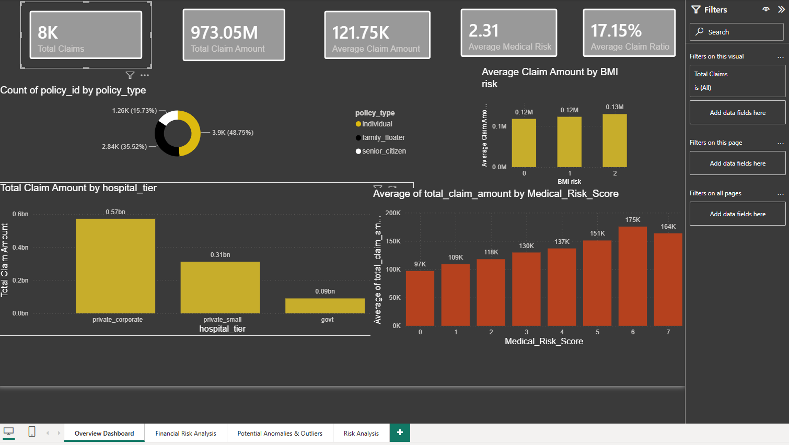
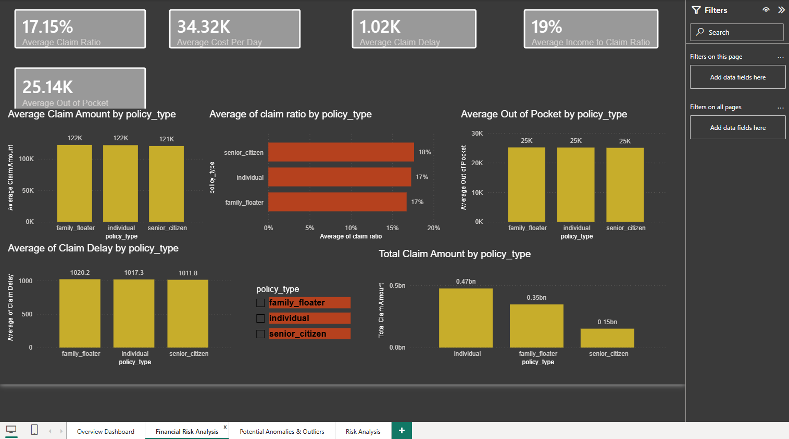
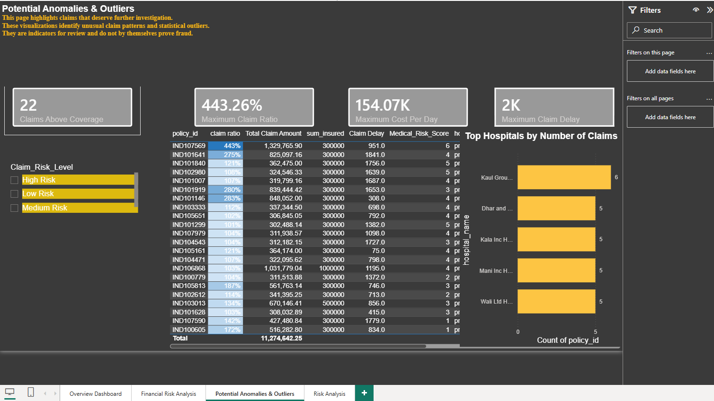
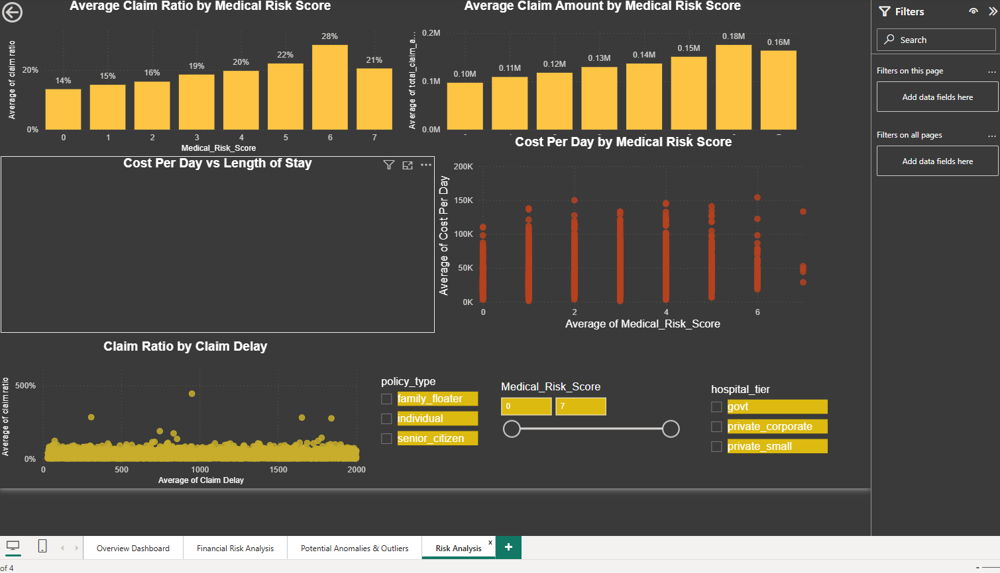

# Insurance Claims Analytics

## Project Overview

This project presents an end-to-end insurance claims analytics solution developed using Microsoft Power BI.

The objective is to analyze medical and financial insurance claims, identify key risk drivers, develop a claim risk scoring framework, and detect statistically unusual claims that may require further investigation.

The project combines data cleaning, feature engineering, risk scoring, exploratory data analysis, financial analysis, and statistical anomaly detection into an interactive Power BI dashboard.

---

## Dashboard Preview

### 1. Overview Dashboard



### 2. Financial Risk Analysis



### 3. Potential Anomalies & Outliers



### 4. Risk Analysis



---

## Project Structure

```text
insurance-claims-analytics/
│
├── dashboard/
│   └── Insurance_Claims_Analytics.pbix
│
├── documentation/
│   ├── Data_Dictionary.md
│   ├── Risk_Model.md
│   └── Anomaly_Detection.md
│
├── dax/
│   ├── Risk_Scoring.md
│   └── Anomaly_Detection.md
│
├── data/
│   └── README.md
│
├── assets/
│   └── screenshots/
│       ├── overview-dashboard.png
│       ├── financial-risk-analysis.png
│       ├── potential-anomalies.png
│       └── risk-analysis.png
│
└── README.md
